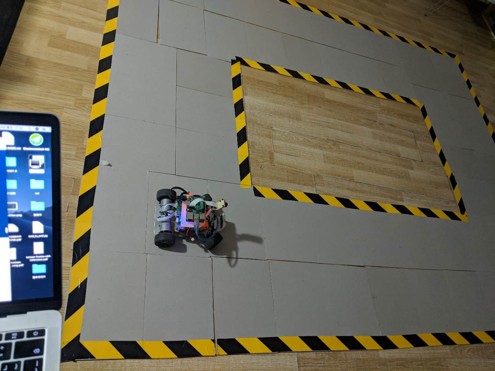

# autonomous-toy-car
在Raspberry Pi上使用深度卷积神经网络实现的自动驾驶玩具车

### 硬件配置
  1. 玩具车底盘
  2. Arduino
  3. Raspberry Pi model B+
  4. 树莓派鱼眼摄像头
  
### 准备工作
  1. Raspberry Pi安装`tensorflow`（建议使用1.9版本）
  2. Raspberry Pi安装Python版本的`opencv2`
  3. 项目依赖`Numpy`，所以保证Raspberry Pi安装好`Numpy`

### 铺建跑道
  可从淘宝购买警示条贴在地板模拟跑道，注意：跑道不易过小，跑道宽度最好2倍于小车宽度。如图：
  
  
### 数据采集
  1. 将socket_ctrl.py上传到Raspberry Pi
  2. 为保证正常运行，必须将`model.py`一并上传至Raspberry Pi
  3. 在socket_ctrl.py同级目录下创建data/img目录
  4. 下载apk目录下的手机端控制软件
  5. Raspberry Pi连接同手机局域网下的wifi，查看IP，修改socket_ctrl.py的ip变量，打开手机控制软件填写对应的ip，端口固定为9999，其他随意填写并点击`设置参数`按钮
  6. 修改socket_ctrl.py的`trainMode`变量为True
  7. Raspberry Pi运行`nohup python -o socket_ctrl.py &`打开服务
  8. 手机端点击`连接`按钮，等待连接状态变为绿色，然后点击`训练模式`进入控制界面，控制小车在轨道内运行并自动采集数据
  9. 查看data/img目录下采集数据的数量，如果达到要求（建议2000+图片）则可停止采集
  
 ### 数据训练
  1. 将采集到的数据下载到本地
  2. 使用你日常训练数据的方式运行`train.py`进行数据训练
  3. 训练结束后，将结果上传到Raspberry Pi
  
 ### 实验训练结果
  1. 修改socket_ctrl.py将`trainMode`变量改为False
  2. 打开手机端，依次点击`连接`、`自动驾驶模式`，将小车放到跑道上测试结果

### 其他
  项目默认通过Arduino控制玩具车，但完全可以自定义硬件设置，直接通过Raspberry Pi控制车，可通过修改socket_ctrl.py文件的`control`函数自定义你的控制方式。
